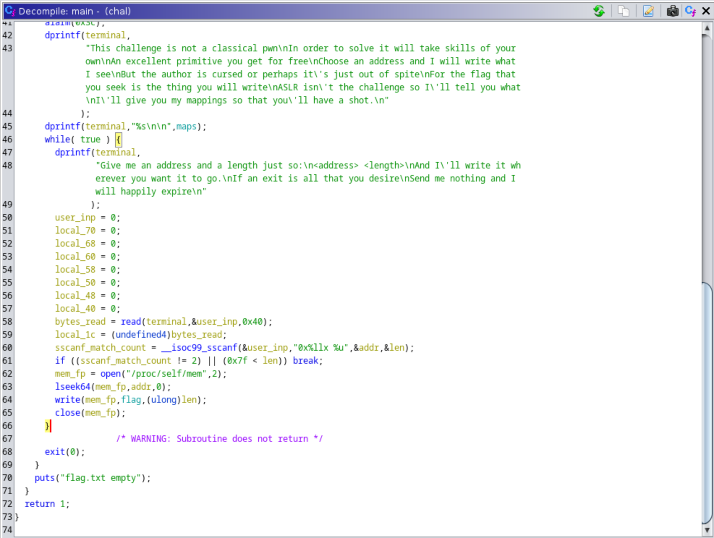

## Introduction

Write Flag Where was a pwn binary exploitation in the 2023 Google Capture the Flag event. In total 294 teams solved this challenge and the final score for this challenge was 50 points.

> This challenge is not a classical pwn  
> In order to solve it will take skills of your own  
> An excellent primitive you get for free  
> Choose an address and I will write what I see  
> But the author is cursed or perhaps it's just out of spite  
> For the flag that you seek is the thing you will write  
> ASLR isn't the challenge so I'll tell you what  
> I'll give you my mappings so that you'll have a shot.

In addition to the challenge prompt, the challenge binary was provided as an [attachment](https://storage.googleapis.com/gctf-2023-attachments-project/1c642ea2575b569441ed311ba1d614fb66ef4c571299b914e30ad2155b13e1075868ad442a04c2c256a4f3379702115820e69d1bce2368aaaef0b2fd30483b39.zip) and the remote IP and port were provided: `wfw1.2023.ctfcompetition.com 1337`.

## Connecting to the challenge

Using netcat, we can connect to the challenge server.

```sh
┌──(mshen㉿kali)-[~/gctf-2023/wfw1]
└─$ nc wfw1.2023.ctfcompetition.com 1337
```

In this challenge, we are also given `/proc/self/maps` which means that ASLR protections are bypassed and we know the memory address locations of the running process.

```
558fad12e000-558fad12f000 r--p 00000000 00:11e 810424                    /home/user/chal
558fad12f000-558fad130000 r-xp 00001000 00:11e 810424                    /home/user/chal
558fad130000-558fad131000 r--p 00002000 00:11e 810424                    /home/user/chal
558fad131000-558fad132000 r--p 00002000 00:11e 810424                    /home/user/chal
558fad132000-558fad133000 rw-p 00003000 00:11e 810424                    /home/user/chal
558fad133000-558fad134000 rw-p 00000000 00:00 0
7fe6513dd000-7fe6513e0000 rw-p 00000000 00:00 0
7fe6513e0000-7fe651408000 r--p 00000000 00:11e 811203                    /usr/lib/x86_64-linux-gnu/libc.so.6
7fe651408000-7fe65159d000 r-xp 00028000 00:11e 811203                    /usr/lib/x86_64-linux-gnu/libc.so.6
7fe65159d000-7fe6515f5000 r--p 001bd000 00:11e 811203                    /usr/lib/x86_64-linux-gnu/libc.so.6
7fe6515f5000-7fe6515f9000 r--p 00214000 00:11e 811203                    /usr/lib/x86_64-linux-gnu/libc.so.6
7fe6515f9000-7fe6515fb000 rw-p 00218000 00:11e 811203                    /usr/lib/x86_64-linux-gnu/libc.so.6
7fe6515fb000-7fe651608000 rw-p 00000000 00:00 0
7fe65160a000-7fe65160c000 rw-p 00000000 00:00 0
7fe65160c000-7fe65160e000 r--p 00000000 00:11e 811185                    /usr/lib/x86_64-linux-gnu/ld-linux-x86-64.so.2
7fe65160e000-7fe651638000 r-xp 00002000 00:11e 811185                    /usr/lib/x86_64-linux-gnu/ld-linux-x86-64.so.2
7fe651638000-7fe651643000 r--p 0002c000 00:11e 811185                    /usr/lib/x86_64-linux-gnu/ld-linux-x86-64.so.2
7fe651644000-7fe651646000 r--p 00037000 00:11e 811185                    /usr/lib/x86_64-linux-gnu/ld-linux-x86-64.so.2
7fe651646000-7fe651648000 rw-p 00039000 00:11e 811185                    /usr/lib/x86_64-linux-gnu/ld-linux-x86-64.so.2
7ffe686cc000-7ffe686ed000 rw-p 00000000 00:00 0                          [stack]
7ffe6877c000-7ffe68780000 r--p 00000000 00:00 0                          [vvar]
7ffe68780000-7ffe68782000 r-xp 00000000 00:00 0                          [vdso]
ffffffffff600000-ffffffffff601000 --xp 00000000 00:00 0                  [vsyscall]
```

The challenge then prints the following message in a `while(true)` loop asking for an address and length:

```
Give me an address and a length just so:
<address> <length>
And I'll write it wherever you want it to go.
If an exit is all that you desire
Send me nothing and I will happily expire
```

## Solution

I used Ghidra to decompile and analyze the provided binary. As I read the code, I also annotated it by renaming the variables using names that made sense and helped me better understand the code.



So from reading the decompiled code, we find that memory of the process is opened and we seek to the specified address and write the specified number of bytes of the flag into memory at that address. So how can we abuse this behaviour to leak the flag? In other words, at what location should we write the flag into the memory so that we can retrieve the flag?

An idea, we can overwrite the "Give me an address and a length" prompt with the flag string. All we need to do is find the address of that prompt so that we can write the flag into the location. We can either use a hex editor or the disassembled assembly code to determine the string prompt's memory location. Using GDB to disassemble the binary, we look for the part when the arguments for the call to `dprintf()` are being prepared which in a hex editor we can simply search for the string.

```
(gdb) disassemble main
Dump of assembler code for function main:
[...]
   0x0000000000001357 <+366>:	lea    rdx,[rip+0xe82]        # 0x21e0
   0x000000000000135e <+373>:	mov    rsi,rdx
   0x0000000000001361 <+376>:	mov    edi,eax
   0x0000000000001363 <+378>:	mov    eax,0x0
   0x0000000000001368 <+383>:	call   0x1090 <dprintf@plt>
[...]
```

Either way, we have determined that the offset for the prompt string is at `0x21e0`. Now all we need to do is add this offset to the binary base. Normally, this is where ASLR would kick in to prevent us from targeting specific memory locations but since in this case the memory maps are provided, the calculations are trivial.

```py
>>> hex(0x558fad12e000 + 0x21e0)
'0x558fad1301e0'
```

### Getting the Flag

With this, getting the flag is trivial. Simply send the calculated address and 127, the maximum allowable length, to leak the flag.

Flag: `CTF{Y0ur_j0urn3y_is_0n1y_ju5t_b39innin9}`

## Appendix: Complete Solve
```
┌──(mshen㉿kali)-[~/gctf-2023/wfw1]
└─$ nc wfw1.2023.ctfcompetition.com 1337
== proof-of-work: disabled ==
This challenge is not a classical pwn
In order to solve it will take skills of your own
An excellent primitive you get for free
Choose an address and I will write what I see
But the author is cursed or perhaps it's just out of spite
For the flag that you seek is the thing you will write
ASLR isn't the challenge so I'll tell you what
I'll give you my mappings so that you'll have a shot.
556a2e45a000-556a2e45b000 r--p 00000000 00:11e 810424                    /home/user/chal
556a2e45b000-556a2e45c000 r-xp 00001000 00:11e 810424                    /home/user/chal
556a2e45c000-556a2e45d000 r--p 00002000 00:11e 810424                    /home/user/chal
556a2e45d000-556a2e45e000 r--p 00002000 00:11e 810424                    /home/user/chal
556a2e45e000-556a2e45f000 rw-p 00003000 00:11e 810424                    /home/user/chal
556a2e45f000-556a2e460000 rw-p 00000000 00:00 0
7f1c1a2cd000-7f1c1a2d0000 rw-p 00000000 00:00 0
7f1c1a2d0000-7f1c1a2f8000 r--p 00000000 00:11e 811203                    /usr/lib/x86_64-linux-gnu/libc.so.6
7f1c1a2f8000-7f1c1a48d000 r-xp 00028000 00:11e 811203                    /usr/lib/x86_64-linux-gnu/libc.so.6
7f1c1a48d000-7f1c1a4e5000 r--p 001bd000 00:11e 811203                    /usr/lib/x86_64-linux-gnu/libc.so.6
7f1c1a4e5000-7f1c1a4e9000 r--p 00214000 00:11e 811203                    /usr/lib/x86_64-linux-gnu/libc.so.6
7f1c1a4e9000-7f1c1a4eb000 rw-p 00218000 00:11e 811203                    /usr/lib/x86_64-linux-gnu/libc.so.6
7f1c1a4eb000-7f1c1a4f8000 rw-p 00000000 00:00 0
7f1c1a4fa000-7f1c1a4fc000 rw-p 00000000 00:00 0
7f1c1a4fc000-7f1c1a4fe000 r--p 00000000 00:11e 811185                    /usr/lib/x86_64-linux-gnu/ld-linux-x86-64.so.2
7f1c1a4fe000-7f1c1a528000 r-xp 00002000 00:11e 811185                    /usr/lib/x86_64-linux-gnu/ld-linux-x86-64.so.2
7f1c1a528000-7f1c1a533000 r--p 0002c000 00:11e 811185                    /usr/lib/x86_64-linux-gnu/ld-linux-x86-64.so.2
7f1c1a534000-7f1c1a536000 r--p 00037000 00:11e 811185                    /usr/lib/x86_64-linux-gnu/ld-linux-x86-64.so.2
7f1c1a536000-7f1c1a538000 rw-p 00039000 00:11e 811185                    /usr/lib/x86_64-linux-gnu/ld-linux-x86-64.so.2
7fffd4a21000-7fffd4a42000 rw-p 00000000 00:00 0                          [stack]
7fffd4bab000-7fffd4baf000 r--p 00000000 00:00 0                          [vvar]
7fffd4baf000-7fffd4bb1000 r-xp 00000000 00:00 0                          [vdso]
ffffffffff600000-ffffffffff601000 --xp 00000000 00:00 0                  [vsyscall]


Give me an address and a length just so:
<address> <length>
And I'll write it wherever you want it to go.
If an exit is all that you desire
Send me nothing and I will happily expire
0x556a2e45c1e0 127
CTF{Y0ur_j0urn3y_is_0n1y_ju5t_b39innin9}
```
